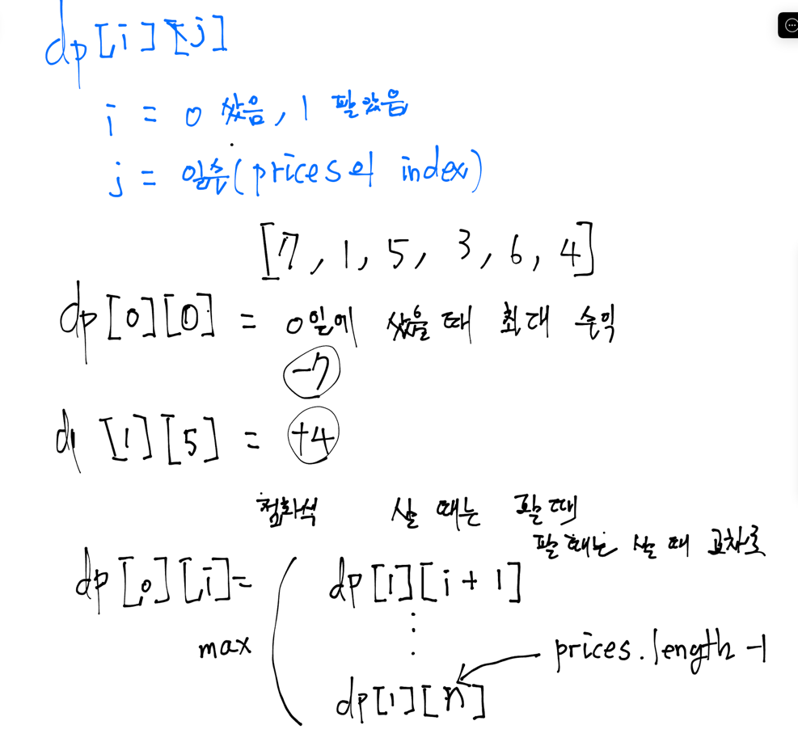

# [Best Time to Buy and Sell Stock II](https://leetcode.com/problems/best-time-to-buy-and-sell-stock-ii/description/)


# 코드
```java
class Solution {
    int[][] dp = new int[2][30001];

    /**
     * sb: 0: 샀음, 1: 팔았음
     */
    private int getMaxProfitDP(int[] prices, int sb, int day) {
        if(day == 0) {
            if(sb == 0) {
                dp[sb][day] = -prices[day];
            } else {
                // 사고 바로 팔면 이득 X
                dp[sb][day] = 0;
            }
            
            return dp[sb][day];
        }
        
        if(dp[sb][day] != -1) {
            return dp[sb][day];
        }
        
        if(sb == 0) {
            // 내가 오늘 살때의 금액은, 과거에 판 날 중에서 가장 큰 이득을 볼 수 있는 날을 찾아야 함
            int maxProfit = 0;
            for(int i = day + 1; i < prices.length; i++) {
                maxProfit = Math.max(maxProfit, getMaxProfitDP(prices, 1, i - 1) - prices[i]);
            }

            dp[sb][day] = maxProfit;
        } else {
            // 내가 오늘 팔았을 때의 금액은, 과거에 산 날 중에서 가장 큰 이득을 볼 수 있는 날을 찾아야 함
            int maxProfit = 0;
            for(int i = day + 1; i < prices.length; i++) {
                maxProfit = Math.max(maxProfit, getMaxProfitDP(prices, 0, i - 1) + prices[i]);
            }

            dp[sb][day] = maxProfit;
        }

        return dp[sb][day];
    }

    public int maxProfit(int[] prices) {

        for(int i = 0; i < dp[0].length; i++) {
            dp[0][i] = -1;
            dp[1][i] = -1;
        }

        int maxProfit = 0;

        for (int i = prices.length - 1; i >= 0; i--) {
            maxProfit = Math.max(getMaxProfitDP(prices, 0, i), getMaxProfitDP(prices, 1, i));
        }

        return maxProfit;
    }
}

```

# 접근 및 풀이방법


