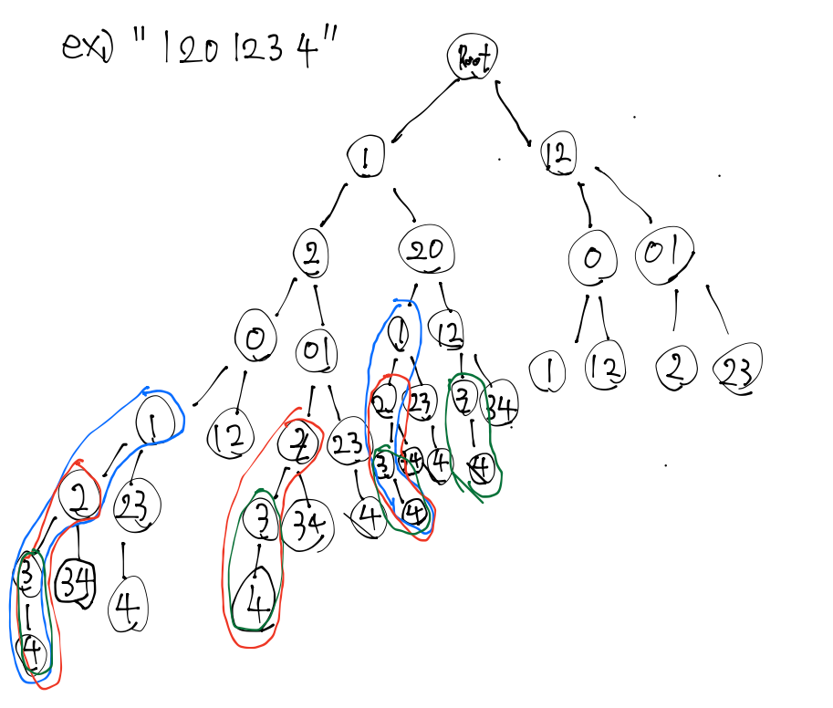

# [Decode Ways](https://leetcode.com/problems/decode-ways/description/)

# 코드
```java
class Solution {
    int[][] dp = new int[101][3];

    private int charNum(char c1, char c2) {
        return (c1 - '0') * 10 + (c2 - '0');
    }

    public int go(char[] ss, int i, int j) {
        // 예외 기저조건 (0으로 시작할 때 불가능)
        if (ss[i] == '0') {
            dp[i][j] = 0;
            return 0;
        }

        // 예외 기저조건 (2자리수로 시작하는데 26이 넘어갈 때 불가능)
        if (j == 2 && charNum(ss[i], ss[i + 1]) > 26) {
            dp[i][j] = 0;
            return 0;
        }

        // 기저조건 (1자리수로 시작할 때)
        if (i == ss.length - 1 && j == 1) {
            dp[i][j] = 1;
            return 1;
        }

        // 기저조건 (2자리수로 시작할 때)
        // "11" -> [1, 1], [11]
        //  단, 1의자리수가 0인 경우에는 1가지 경우만 존재한다.
        //    "10" -> [10]
        //    "20" -> [20]
        if (i == ss.length - 2 && j == 2) {
             if (ss[i + 1] == '0') {
                dp[i][j] = 1;
                return 1;
            }

            dp[i][j] = 2;
            return 1;
        }

        // 메모이제이션
        if (dp[i][j] != -1) {
            return dp[i][j];
        }

        // j가 2일 때에는 문자열을 하나 건너뛰어왔기 때문에, 인덱스도 마찬가지로 하나 건너 뛰어주자
        int oneDp = go(ss, i + j, 1);;
        int twoDp = (i + j) <= ss.length - 2 ? go(ss, i + j, 2) : 0;

        dp[i][j] = oneDp + twoDp;

        return dp[i][j];
    }

    public int numDecodings(String s) {
        char[] chars = s.toCharArray();

        // DP 태울필요 없이 바로 반환 (DP로직에서 예외처리 안해줬기 때문에)
        if (chars.length == 1) {
            return chars[0] == '0' ? 0 : 1;
        }

        for (int[] d : dp) {
            d[1] = -1;
            d[2] = -1;
        }
        for (int i = 0; i < chars.length - 1; i++) {
            go(chars, i, 1);
            go(chars, i, 2);
        }

        int oneDp = dp[0][1];
        int twoDp = dp[0][2];

        if (oneDp == -1 && twoDp == -1) {
            return 0;
        }

        // 2자리수로 시작하는 경우 예외처리
        // 기본적으로는 twoDp의 값을 취한다.
        // 단 2자리수인 경우 26을 넘어가더라도 oneDp의 값이 존재할 수 있기 때문에, 둘 중에 큰 값을 취한다.
        if (chars.length == 2) {
            return Math.max(oneDp, twoDp);
        }

        return oneDp + twoDp;
    }
}
```

# 접근 및 풀이 방법
```text
일단 백트래킹해보고 중복문제 찾기
- 중복문제 존재? YES
- DP로 접근 가능한가(base값을 가질 수 있는가?)? YES
	- 단 자릿수별로 가지를 쳐야 한다. (아래 규칙)


규칙
1. 뒤 이어지는 숫자 1자리(1의자리)까지 가지는수 dp
	- 단 0인 경우에는 X
	- 그 외는 무조건 1가지
2. 뒤 이어지는 숫자 2자리(10의자리)까지 가지는수 dp
	- 단 26이 넘어가는 경우에는 X
	- 그 외는 2가지
		- 단 뒤 1의자리수가 0인 경우에는 1가지


ex) "11106"

first = 1 (0)
- 1 
  - 1
   - 
  - 0 (invalid)
  - 6 
- 1
- 0 (invalid)
- 6

first = 1 (1)
- 1
- 1
- 0 (invalid)
- 6


정의:
i = 문자열 인덱스
j = 자릿수 (1, 2)
dp[i][j] = i 인덱스에서 시작하면서 이어지는 j자리의 문자열로 시작하는 경우 일 때 decode 방법의 수

s     = "11106"
index = (01234)

ex) i = 2, j = 1 (index 2인 1로 시작하면서 이어지는 1자리의 문자열로 시작하는 경우
 answer: 0 
		- [1, 06] <- (해당 경우 invalid 하기 때문에 answer = 0)

ex) i = 2, j = 2
 answer: 1
	  - [10, 6]
---------------------------------------------------------------------	  
점화식:
dp[i][j] = 
 if(i가 마지막이고 j == 1 일 때) {
	 1
 }
 
 if(i가 마지막에서 한칸 더 앞이면서 j == 2일 때) {
	 if(1의자리가 0일 때) {
		 1	 
	 } else {
		 2
	 }
 }

 if(s[i] > '0' && (char) (s[i] + s[i + 1]) < 'Z') {
		dp[i + 1][1] + dp[i + 1][2]
 } else {
	 0
 }


만약 
dp[1][1] = max(dp[2][1], dp[2][2]) 인 경우
 - (dp[2][1]이 0이기 때문에 포함되지 않아야 한다.)
 
"1106"
"1" dp[1][1]
"106" (dp[2][1], dp[2][2])
[1, 10, 6] (dp[2][2])
[1, 0, 6] (dp[2][1] invalid) 
[1, 06] (dp[2][1] invalid)
```

아래 이미지 색깔별로 중복문제(메모이제이션 대상)

