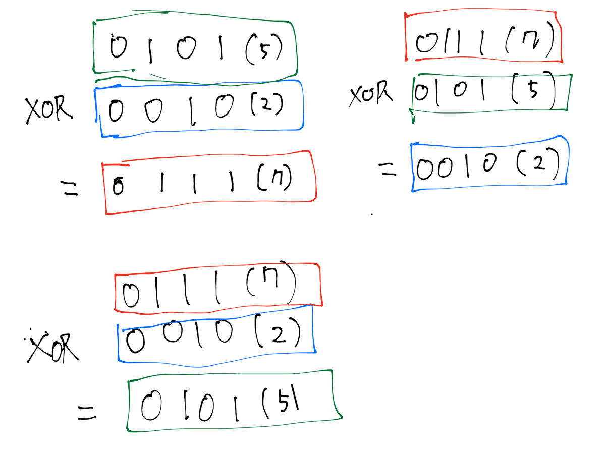
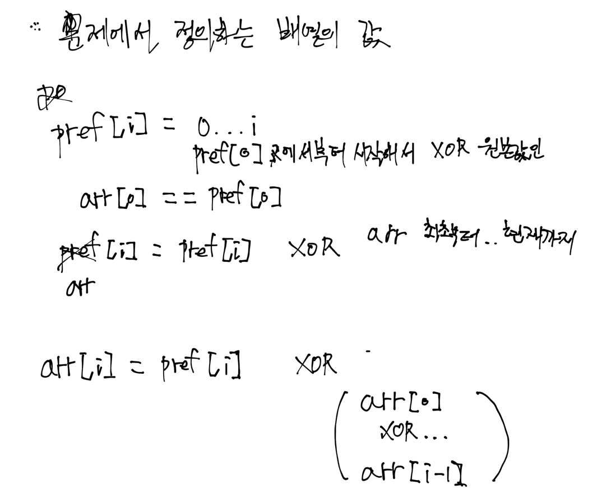
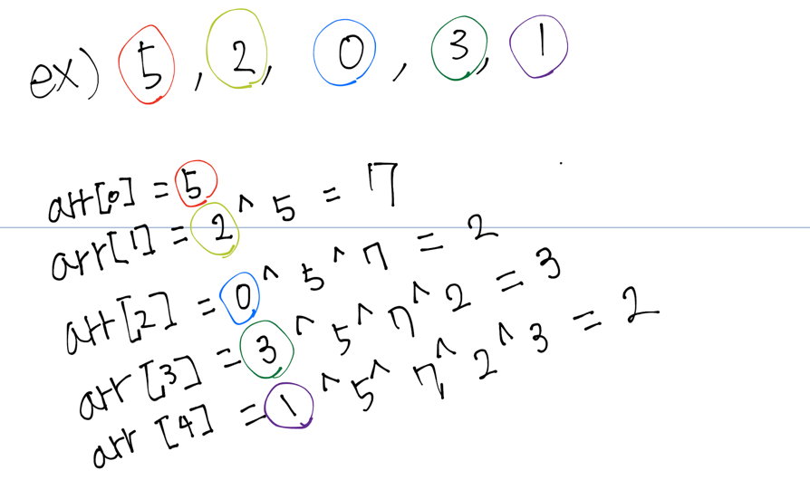
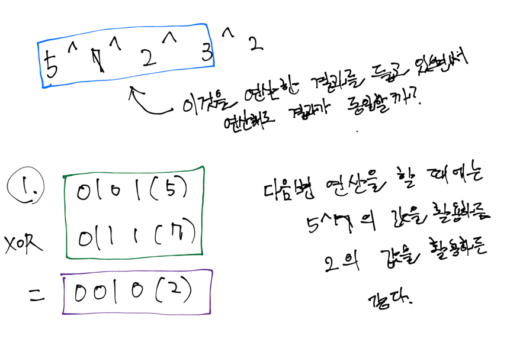

# [Find The Original Array of Prefix Xor](https://leetcode.com/problems/find-the-original-array-of-prefix-xor/description/)

# 코드
```java
class Solution {
    public int[] findArray(int[] pref) {
        int[] arr = new int[pref.length];
        arr[0] = pref[0]; // 최초 xor 원본값의 첫번째 값은 항상 동일하다. 

        // 이제껏 xor 연산한 결과 담아놓을 곳
        int tmp = arr[0];
        for (int i = 1; i < pref.length; i++) {
            arr[i] = pref[i] ^ tmp;
            tmp ^= arr[i];
        }

        return arr;
    }
}
```

# 접근 및 풀이방법
1. 문제에서 묻는 결과 값은 입력으로 주어지는 값을 xor 연산 전의 원본값이다.
2. xor 연산의 특성을 고려해보니 xor을 연산 결과의 값과 다시 재연산해주면 기존 어떤 피연산자와 연산했는지 원본값을 구할 수 있다.
   3. 예를 들어, 1 ^ 2 = 3이라면, 3 ^ 2 = 1이다.

XOR 특성


출력배열 정의


출력배열 식


XOR 연산 결과는 매번 처음부터 구해야 할까?의 고민

