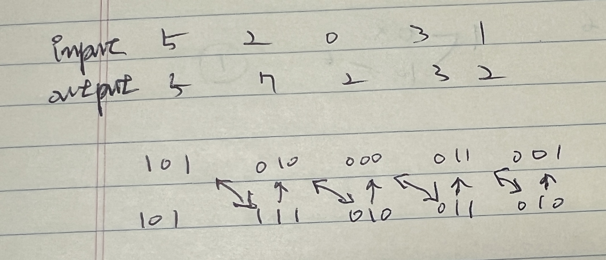

```kotlin
fun main() {
    findArray(intArrayOf(5, 2, 0, 3, 1))
    findArray(intArrayOf(13))
}

fun findArray(pref: IntArray): IntArray {
    val result = IntArray(pref.size) { 0 }

    result[0] = pref[0]

    for (i in 1 until pref.size) {
        result[i] = pref[i - 1] xor pref[i]
    }

    return result
}
```

시작 값은 원 array의 첫 번째 요소와 같고 이후(두번째 요소 부터) 순차적으로 진행시 현재 index와 이전 index의 xor(^)연산 값이 해당 index의 값이 됩니다


