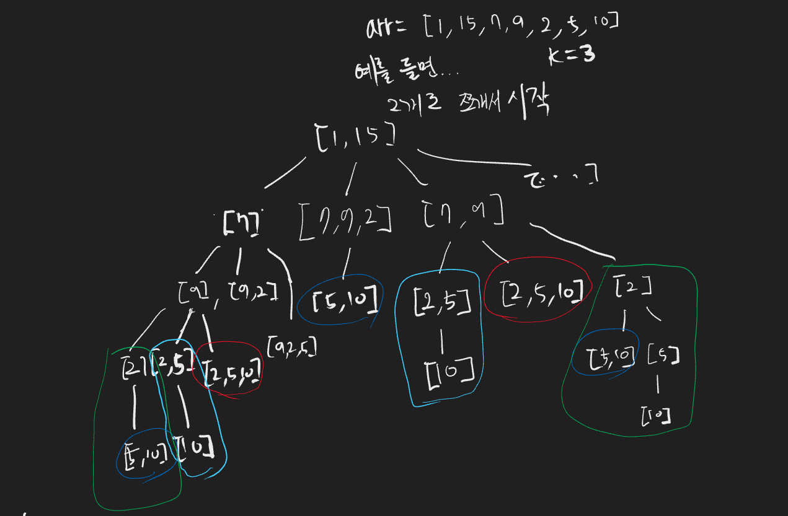
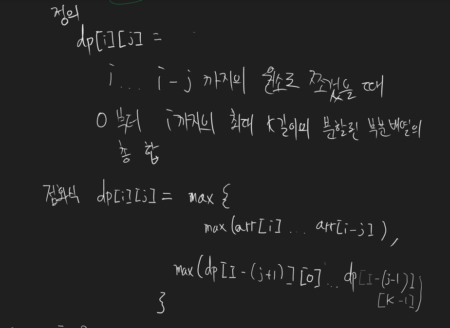
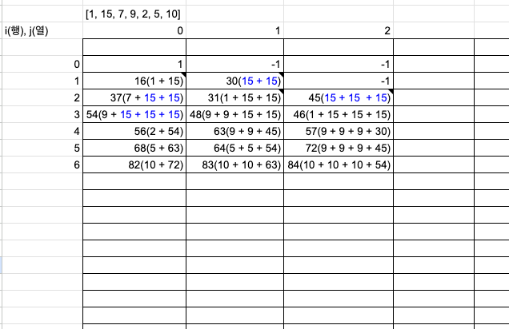

# [Partition Array for Maximum Sum](https://leetcode.com/problems/partition-array-for-maximum-sum/description/)

# 코드

```java
class Solution {
    int[][] dp = new int[500][500];

    // j는 편의를 위해 0 base로 설정
    // 0이면 i 자기 자신만 포함하여 partition 되는것이고, 1이면 [i, i+1]까지 포함하여 partition 되는것이다.
    // 즉 실제 개수에서 -1된 것 (최초 호출시에 j는 -1해주어야 함)
    public int dpGo(int[] arr, int i, int j, int k) {
        // 기저 조건
        if (i == 0) {
            if (dp[i][j] != -1) {
                return dp[i][j];
            }

            dp[i][j] = arr[0];
            return dp[i][j];
        }
        if (i > 0 && j == 0) {
            if (dp[i][j] != -1) {
                return dp[i][j];
            }

            int current = arr[i];

            int prevMax = 0;
            for (int jj = k - 1; jj >= 0; jj--) {
                prevMax = Math.max(prevMax, dpGo(arr, i - 1, jj, k));
            }

            dp[i][j] = current + prevMax;

            return dp[i][j];
        }

        if (dp[i][j] != -1) {
            return dp[i][j];
        }

        /**
         * 현재 인덱스에서 나를 포함한 이전 j + 1개만큼의 최대값의 파티션 어레이의 합
         */
        int currentMax = arr[i];

        for (int ii = i; ii >= i - j; ii--) {
            // 음수일때는 그 이전 인덱스가없기 때문에 최근까지 구해진 최대값이 구할 수 있는 최선의 최대값
            if (ii < 0) {
                break;
            }
            currentMax = Math.max(currentMax, arr[ii]);
        }

        if (j + 1 > arr.length) {
            dp[i][j] = currentMax;
            return dp[i][j];
        }

        // 적어도 그 전 인덱스까지 존재해야 파티션 어레이의 최대값을 구할 수 있음
        // ex) i = 1, j= 2 이면 이미 최대 자기자신을 포함한 갯수는 총 2개인데 그 이전 인덱스가 없으므로 최대값을 구할 수 없음
        int currentMaxSum = 0;
        if (i - j >= 0) {
            currentMaxSum = currentMax * (j + 1);
        } else {
            currentMaxSum = currentMax * (i + 1);
        }

        /**
         * 이전 DP에서 나를 포함하지 않은 이전 j + 1개만큼의 파티션 어레이에 포함되지 않은 파티션 어레이의 합 중 최대값
         */
        int prevMaxSum = 0;

        // 이전 DP가 존재하지 않는다면 0으로 취급 (즉 현재 나의 파티션 어레이의 최대값의 합이 최대값임)
        if (i - (j + 1) >= 0) {
            for (int jj = 0; jj < k; jj++) {
                prevMaxSum = Math.max(prevMaxSum, dpGo(arr, i - (j + 1), jj, k));
            }
        }

        dp[i][j] = currentMaxSum + prevMaxSum;

        return dp[i][j];
    }

    // [1, 15, 7, 9, 2, 5, 10]
    // [9, 2](3, 1) 일 때에는 ([5](4, 0) [5, 10](4, 1), [5, ...](4, k)) 까지의 최대값과
    // 나의 최대값을 더한 결과가 dp에 저장되어야 한다.
    public int maxSumAfterPartitioning(int[] arr, int k) {

        for (int i = 0; i < 500; i++) {
            for (int j = 0; j < 500; j++) {
                if (i == 0) {
                    dp[i][j] = arr[0];
                } else {
                    dp[i][j] = -1;
                }
            }
        }

        int answer = 0;

        for (int i = arr.length - 1; i >= 0; i--) {
            for (int j = k - 1; j >= 0; j--) {
                answer = Math.max(answer, dpGo(arr, i, j, k));
            }
        }

        return answer;
    }
}
```

# 접근 및 풀이방법

1. 중복문제를 정의하기 위해, 어떻게 최선의 파티션 어레이로 쪼갤 수 있고, 그 최선의 파티션 어레이가 쪼개진 경우에도 그 이후의 파티션 어레이의 최대값에도 활용될 수 있는지 확인해봤다.
2. xor 연산의 특성을 고려해보니 xor을 연산 결과의 값과 다시 재연산해주면 기존 어떤 피연산자와 연산했는지 원본값을 구할 수 있다.
    - 예를 들어, 1 ^ 2 = 3이라면, 3 ^ 2 = 1이다.

중복문제 탐색<br/>


DP 정의, 점화식<br/>


DP 테이블<br/>


# 개선점
1. 런타임이 1401ms로 나온것으로 보아, 아슬아슬하게 통과된것 같다. 중복문제를 메모이제이션 하는것까지 성공했지만, 혹시나 그 중복문제를 구하는 과정도 더 효율화 지금은 O(N^2)라고 생각하는데, 혹시 이 이상이 걸리는 구조일진 않을지 검토가 필요해보인다.
2. j, 즉 몇개의 원소로 분할할것인가 의 기준을 실제 갯수에서 -1된 갯수로 설정했는데 이렇게 하니까 인덱스 관점에선 편하지만, 디버깅하는데에 인지성이 매우 떨어졌다. 다음부터는 이렇게 안잡아야지..
3. 아직 DP내의 점화식 내에서 소요되는 시간복잡도 계산이 미숙하다. 이 부분을 더 공부해야겠다.
