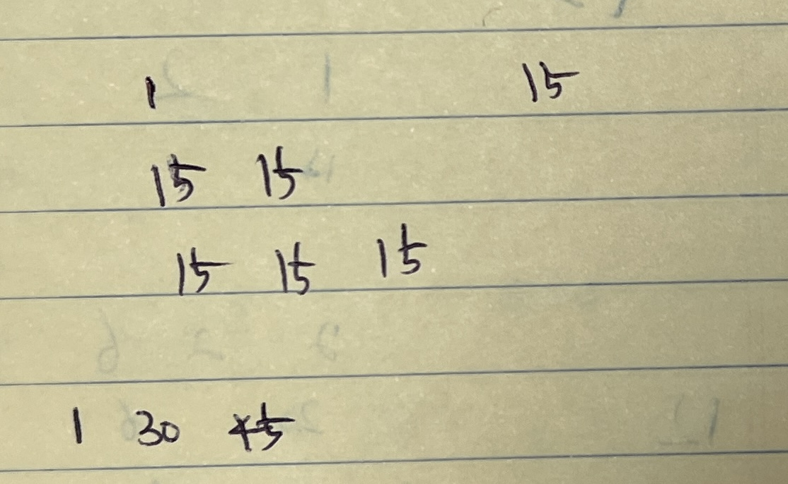

```kotlin
fun main() {
    println(maxSumAfterPartitioning(intArrayOf(1, 15, 7, 9, 2, 5, 10), 3))
    println(maxSumAfterPartitioning(intArrayOf(1, 4, 1, 5, 7, 3, 6, 1, 9, 9, 3), 4)) // 4,4 / 7,7,7 / 9,9,9,9 / 9,9
    println(maxSumAfterPartitioning(intArrayOf(1), 1))
}

fun maxSumAfterPartitioning(arr: IntArray, k: Int): Int {
    val result = Array(arr.size) { 0 }

    arr.forEachIndexed { i, _ ->
        val lastIdx = min(i + k - 1, arr.size - 1)

        for (j in i..lastIdx) {
            val max = arr.slice(j..lastIdx).maxOrNull() ?: 0
            val prevIdx = j - 1
            var prevMax = 0

            if (prevIdx > 0) {
                prevMax = result[prevIdx]
            }

            result[i] = max(result[i], prevMax + max * (j - i + 1))
        }
    }

    return result.last()
}
```



1. 순차적(loop)으로 원소 1개씩 접근한다
2. result(int array)에 순차적으로 진행되는 index에 max값을 저장한다
3. result의 마지막 값이 max다 

순차적으로 진행하면서 1개의 사이즈부터 최대 사이즈`k`만큼만 loop를 돌면서 max값을 구하고  
해당 카운트 값(1,2,...k)의 배수 만큼을 이전 idx의 값과의 합을 해당 index 저장해주면 될 것이라고 생각하고 구현했으나 구현 실패
