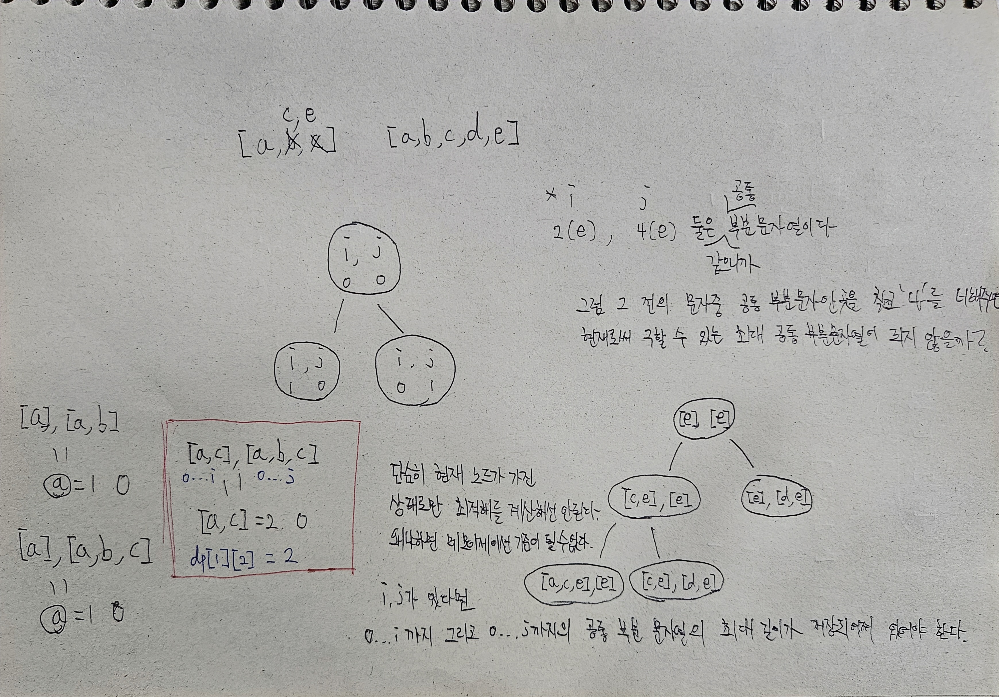
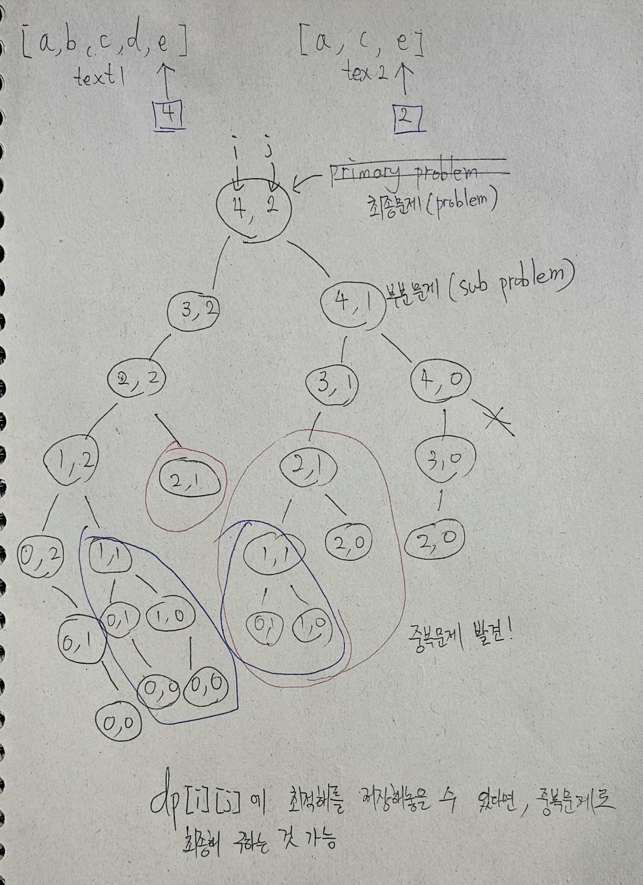
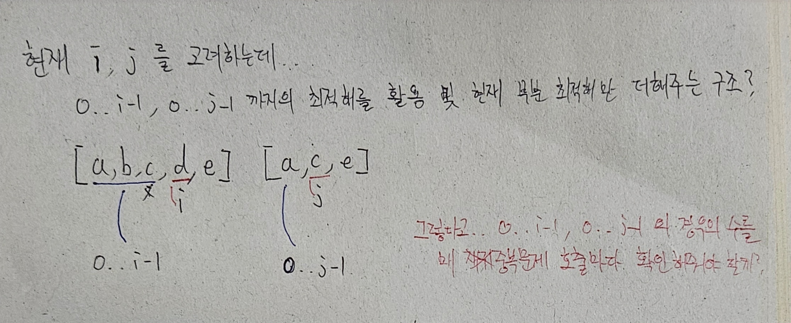
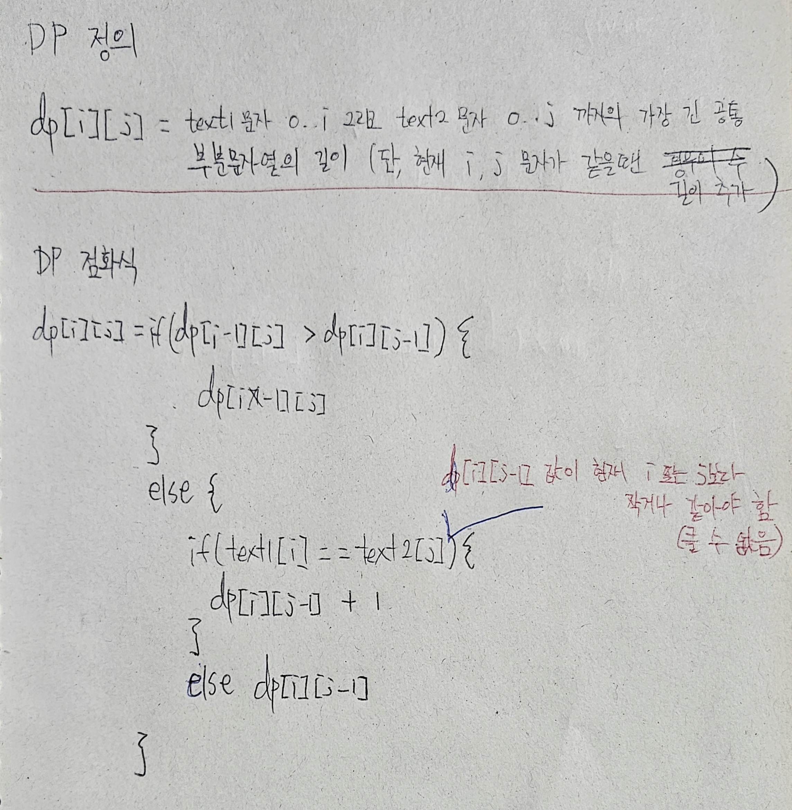
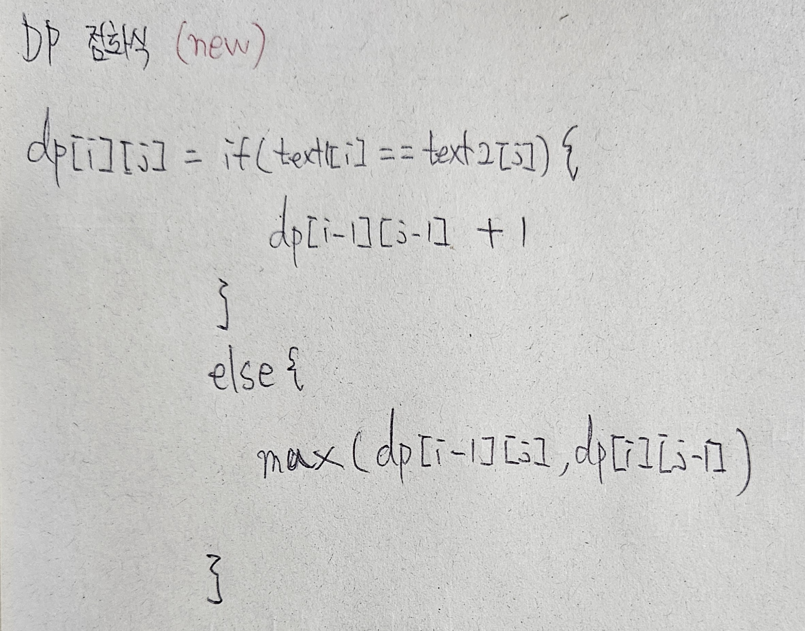
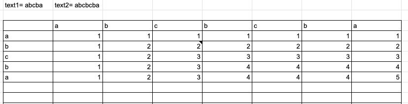
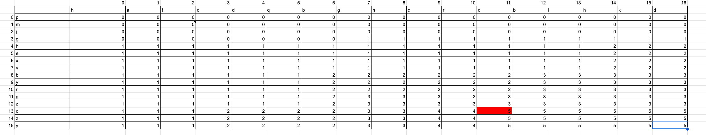

# [Longest Common Subsequence](https://leetcode.com/problems/longest-common-subsequence/description/)

# 코드

최종 Accepted 코드
```java
class Solution {
    int[][] dp = new int[1000][1000];
    char[] t1;
    char[] t2;

    public int dpGo(int i, int j) {
        if (i < 0 || j < 0) {
            return 0;
        }

        if (dp[i][j] != -1) {
            return dp[i][j];
        }

        int prevLeft = dpGo(i - 1, j);
        int prevRight = dpGo(i, j - 1);
        int prevWithout = dpGo(i - 1, j - 1);

        // 만약 현재 구하려는 부분문제의 공통 문자가 같다면, 현 문자를 제외한 그 전의 결과에서 현 문제를 구하면 된다.
        if (t1[i] == t2[j]) {
            dp[i][j] = 1 + prevWithout;
        }
        // 만약 현재 구하려는 부분문제의 공통 문자가 다르다면, 이전의 결과 중에서 최대값을 선택하면 된다.
        // 그것은 현재 text1에서 하나 뺀 결과의 부분문제일수도, text2에서 하나 뺀 결과의 부분문제일수도 있다.
        // 어찌됐건 둘 중에 하나의 값이 현재 구할 수 있는 문제의 최적해라는것은 확실하다.
        else {
            dp[i][j] = Math.max(prevLeft, prevRight);
        }

        return dp[i][j];
    }

    public int longestCommonSubsequence(String text1, String text2) {
        t1 = text1.toCharArray();
        t2 = text2.toCharArray();

        for (int i = 0; i < 1000; i++) {
            for (int j = 0; j < 1000; j++) {
                dp[i][j] = -1;
            }
        }

        int ans = dpGo(t1.length - 1, t2.length - 1);

        return ans;
    }
}
```


Wrong Answer 코드
```java
class Solution {
    int[][] dp = new int[1000][1000];
    char[] t1;
    char[] t2;

    public int dpGo(int i, int j) {
        if (i < 0 || j < 0) {
            return 0;
        }

        if (dp[i][j] != -1) {
            return dp[i][j];
        }

        int left = dpGo(i - 1, j);
        int right = dpGo(i, j - 1);

        if (left > right) {
            // 이 경우는 이미 나 자신의 부분문자를 포함한 경우 이기 때문에 최대 길이는 그 전값을 그대로 활용한다.
            dp[i][j] = left;
        } else {
            dp[i][j] = right;

            // 부분문제 최적해가 만약 현재 구하려는 본문제 최적해의 길이를 넘을수는 없다!
            boolean isOver = (right + 1 > (i + 1)) || (right + 1 > (j + 1));

            // 현재 대상의 문자가 모두 같으면 공통 부분문자 최대 길이가 하나 더 증가한 꼴
            // i == 0 && j == 0 인것도 여기서 커버됨
            if (t1[i] == t2[j] && !isOver) {
                dp[i][j]++;
            }
        }

        return dp[i][j];
    }

    public int longestCommonSubsequence(String text1, String text2) {
        t1 = text1.toCharArray();
        t2 = text2.toCharArray();

        for (int i = 0; i < 1000; i++) {
            for (int j = 0; j < 1000; j++) {
                dp[i][j] = -1;
            }
        }

        int ans = dpGo(t1.length - 1, t2.length - 1);

        return ans;
    }
}
```

# 접근 및 풀이방법

1. 중복문제를 정의하기 위해, 전체문자열이 아닌 현재 위치의 문자 기준으로의 공통 문자열이 구성될 수 있는지 고민했다.

아이디어<br/>

중복문제 탐색<br/>

<br/>


DP 정의, 점화식<br/>



DP 테이블<br/>


DP 문제 테이블<br/>


# 개선점
1. Bottom Up (작은 문제에서 부터 채워나가는) 방식으로 하면 1차원으로도 가능할것 같다.
