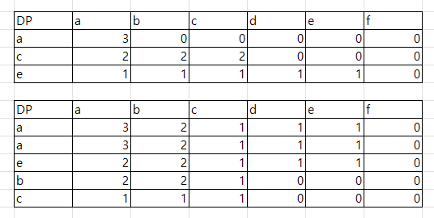

# 문제
https://leetcode.com/problems/longest-common-subsequence/
1143. Longest Common Subsequence

# solution
```java
class Solution {
    int[][] dp;
    public int longestCommonSubsequence(String text1, String text2) {
        char[] t1 = text1.toCharArray();
        char[] t2 = text2.toCharArray();

        dp = new int[text1.length()][text2.length()];
        for (int i = 0; i < dp.length; i++) {
            Arrays.fill(dp[i], -1);
        }
        return dp(t1, t2, 0, 0);
    }

    private int dp(char[] t1, char[] t2, int t1Index, int t2Index) {
        if (t1Index == t1.length || t2Index == t2.length) return 0;

        if (dp[t1Index][t2Index] > -1) return dp[t1Index][t2Index];

        int none = dp(t1, t2, t1Index, t2Index + 1);

        int plus = 0;
        int use;
        if (t1[t1Index] == t2[t2Index]) {
            plus = 1;
            use = dp(t1, t2, t1Index + 1, t2Index + 1);
        } else {
            use = dp(t1, t2, t1Index + 1, t2Index);
        }


        dp[t1Index][t2Index] = Math.max(none, plus + use);
        return dp[t1Index][t2Index];
    }
}
```

# 풀이
dp 풀이
DP는 2차원 배열을 이용해서 사용 행은 text1 열은 text2의 index를 사용
top-down 방식으로 접근

해결 방법
1. 엣지 케이스(text의 마지막 까지 순회, 이미 계산한 케이스는 스킵)
2. text1과 text2에 해당하는 포인터를 만들어 진행
3. 경우의 수는 2가지 text2의 알파벳을 사용하는 케이스, 사용하지 않는 케이스 
4. 두 케이스중 더 큰 값이 나오는 케이스를 메모이제이션 한다. 

