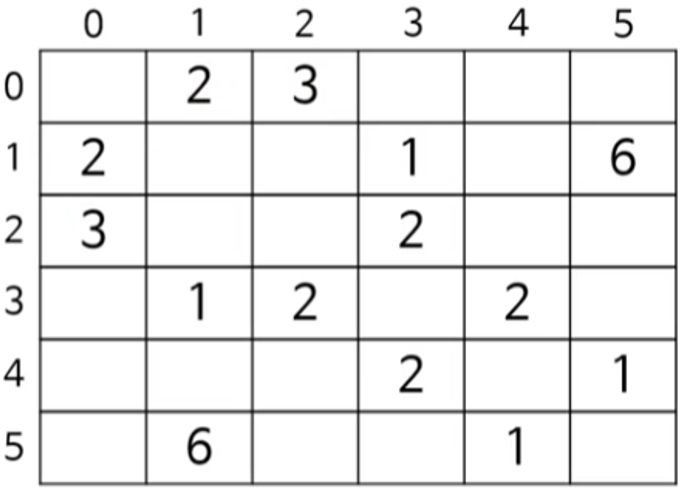
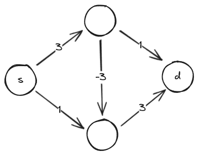

# 다익스트라

두 노드 사이의 최단 경로를 찾는 데 방대한 네트워크 노드에서 충분히 빠른 알고리듬이다.

변의 가중치가 음수인 경우에는 제대로 작동하지 않음에 유의한다. (대체적으로 일반적인 물리량은 양수이기에 실세계에서 사용하기에는 충분함)

대표적인 활용: 네비게이션 / IP 라우팅 / 경유 항공편 찾기

## 이 기법을 가르치는 커리큘럼에 대해

POCU 아카데미 기준, ‘그래프’ 섹션에서 `그래프의 개요` -> `그래프의 DFS` -> `그래프의 BFS` 그 이후에 `다익스트라`가 등장한다. 즉, 최단거리 알고리즘으로써 다익스트라를 접하게 되고, 이후에 등장하는 알고리즘으로는 `에이스타`(네비게이션 원리), `플로이드 워셜` 알고리즘이다.

POCU 아카데미 그래프 이론

- 다익스트라 전
  - 그래프 기초
  - DFS
  - BFS
- **다익스트라**
- 다익스트라 후
  - A\*
  - 플로이드 워셜
- 다익스트라 후후
  - MST
  - 크러스컬
  - 외판원
  - 흐름 네트워크 최대 유량
  - 수요와 유통
  - 에드몬드 카프

나머지 그래프 이론에서 최소신장트리(MST), 크러스컬 알고리즘, 외판원문제, 흐름 네트워크 최대 유량, 수요와 유통 문제, 에드몬드-카프 알고리즘 등이 있다.

참고: [큰돌의 터전 8주차](https://blog.naver.com/jhc9639/222349335717)(마지막주차 - 중요도 순서라고 함 )

- 펜윅트리
- 다익스트라
- 벨만포드(다익스트라 음의 가중치 보완 버전)
- 플로이드 워셜

> [!NOTE]
> 다익스트라 알고리즘은 암기할 필요가 없다. 실무에서 필요하게 되면 그 때 인터넷 등을 참고하여 구현할 수 있으면 된다. (물론 코딩테스트 준비하는 거면 다른 문제, 하지만 다익스트라는 '기본'의 범위는 넘어서는 것이기 때문에, 면접에서 물어보는 것은 약간 과하다 할 수 있겠다. 이는 전적으로 개인의 판단)

## 기초

모든 노드를 <u>**한 번씩**</u> 방문하며 아래의 연산을 수행한다.

1. 아직 방문하지 않은 노드 중에서 **가장 가까운 노드** n 을 선택한다.
   1. 다익스트라는 동적계획법(DP) 이다. → 그리드를 그려보기!
      (힌트: 인접행렬 방식의 매트릭스)
2. n 의 각 이웃 노드 m 으로 여행하는 거리를 계산 (n의 거리 + n→m 으로의 거리)
3. 이 결과가 m 의 기존 거리보다 가까우면 m 의 거리를 업데이트한다.

> [!NOTE]
> 알고리즘 학습의 의의: 알고리즘 자체를 개발하는 건 어려운 일. 대신, 특정 알고리즘을 어떤 상황에 적절히 활용할 수 있는가가 우리에겐 중요한 문제. 이러한 감각은 다양한 상황을 접하며 체득하는 것이 유일한 학습법. 사실 더 어려운 건 실세계의 문제를 어떻게 자료구조화 하는가(무엇이 노드고 무엇이 변인가를 디자인 하는 것)이 어려운 문제이긴 하다. 이것도 마찬가지로 체화시키는 방법 뿐.(전문가)

## 구체적인 방법

> [!NOTE]
> 포큐 아카데미에서는 책 모양이다. 이해만 하고 넘어가면 되는 개념을 의미 → 개념만 이해하고 나중에 필요하게 되면 찾아서 쓰면 됨.

1. 아직 방문하지 않은 노드 중 가장 거리 값이 작은 노드 n 을 선택
2. 각 n 으로부터 미방문 이웃 m 으로 가는 더 짧은 경로가 있다면 업데이트 (`h`: here, `n`: next)
   - `distance[h] = min(distance[n], distance[h] + distanceBetween(h,n))`
3. (종료조건)까지 1~2를 반복
   1. (종료조건1) 모든 노드를 방문했을 때
   2. (종료조건2) `h` 이 목적지일 때
4. 목적지까지의 거리(또는 경로)를 반환

## 구현하기

문제: **집**에서 **학교**까지의 최단거리


| [0] | [1]    | [2]  | [3]  | [4]    | [5]  |
| --- | ------ | ---- | ---- | ------ | ---- |
| 집  | 경찰서 | 공원 | 은행 | 도서관 | 학교 |

### 1. 인접행렬 생성하기

물론, 인접리스트를 활용하는 것도 옵션이다. 상황에 맞게



### 2. 거리 배열 만들고 무한대로 초기화하기

| 순서 | [0] | [1] | [2] | [3] | [4] | [5] |
| ---- | --- | --- | --- | --- | --- | --- |
| 0.   | INF | INF | INF | INF | INF | INF |

### 3. 거리배열 채워보기

| 순서 | [0] | [1] | [2] | [3] | [4] | [5] |
| ---- | --- | --- | --- | --- | --- | --- |
| 0.   | INF | INF | INF | INF | INF | INF |
| 1.   | 0   | INF | INF | INF | INF | INF |
| 2.   | 0   | 2   | 3   | INF | INF | INF |
| 3.   | 0   | 2   | 3   | 3   | INF | 8   |
| 4.   | 0   | 2   | 3   | 3   | INF | 8   |
| 5.   | 0   | 2   | 3   | 3   | 5   | 8   |
| 6.   | 0   | 2   | 3   | 3   | 5   | 6   |

1. 0에서 0으로 가는 거리는 0이다. 무한대보다 작으므로 0을 채워준다.

- 시작 위치이기 때문에 0을 선택한 것

2. 0에서 이웃으로 갈 수 있는 가짓수는 2가지이다. 경찰서(1) 또는 공원(2).
   1. `distance[1] = min(distance[0] + distanceBetween(0, 1), distance[1])` ⇒ min(2, INF) ⇒ 2
   2. `distance[2] = min(distance[0] + distanceBetween(0, 2), distance[2])` ⇒ min(3, INF) ⇒ 3
   3. 0은 방문처리
3. 1에서 이웃으로 갈 수 있는 가짓수는 2가지이다. 은행(3), 학교(5) (방문처리된 0은 제외)

- 아직 방문하지 않은 노드 중 1의 거리값이 가장 작기 떄문에 1은 선택한 것
  1. distance[3] = 식 생략 ⇒ min((2 + 1), INF) ⇒ 3
     1. `2`: (현재까지) 1까지의 최소거리
     2. `1`: 1과 3 사이의 거리
  2. distnace[5] = 식 생략 ⇒ min((2 + 6), INF) ⇒ 8
     1. `2`: (현재까지) 1까지의 최소거리
     2. `6`: 1과 5 사이의 거리

4. 2에서 이웃으로 갈 수 있는 가짓수: 1가지. 은행(3)

- 아직 방문하지 않은 노드 중 2의 거리값이 가장 작기 떄문에 2을 선택한 것
  1. `distance[3] = min(distance[2] + distanceBetween(2,3), distance[3])` ⇒ min(3 + 2, 3) ⇒ 3
     1. 교체되지 않음

5. 3에서 이웃으로 갈 수 있는 가짓수: 1가지. 도서관(4)

- 아직 방문하지 않은 노드 중 2의 거리값이 가장 작기 떄문에 2을 선택한 것
  1. (생략)

6. 4에서 이웃으로 갈 수 있는 가짓수: 학교(5)

- 아직 방문하지 않은 노드 중 4의 거리값이 가장 작기 떄문에 4을 선택한 것
  1. `distance[5] = min(distance[4] + distanceBetween(4,5), distance[5])` ⇒ min(5 + 1, 8) ⇒ 6
     1. **🚩Point! 기존 8에서 6으로 바뀐다.**

7. 더 이상 갈 곳이 없다. 모두 방문했다. 학교의 최소값은 6이기 때문에, 집 → 학교 최단거리는 6이다.

> [!NOTE]
> 위 진행에서는 공교롭게도 노드의 번호 순서대로 탐색을 진행(1→2→3→…)하는데, 실제 알고리즘에서는 방문하지 않은 노드 중에서 가장 거리값이 작은 노드를 선택해야 함을 기억하자!

## 인접행렬 사용시 문제점

실생활의 지도에서 교차로는 그래프의 정점(vertex, node)에 해당하고 그 사이의 도로는 그래프의 변(edge)한다. 교차로는 인접교차로와 기껏해야 몇개정도의 연결을 갖는다. 가령, 사거리에 해당하는 교차로는 인접 교차로와 최대 4개의 연결을 갖는다.

그런데 서울시에 존재하는 모든 교차로를 인접행렬로 나타내려고 하면 문제가 된다. 사거리는 연결될 수도 없는 다른 교차로와의 연결 가능성(?) 때문에 메모리 공간을 할당하고 있어야 하는 문제가 생긴다.

이런 경우 인접리스트를 사용하는 것이 유리할 것이다.

## 다익스트라 시간복잡도

N: 노드수, E: 변 수(엣지)

- 노드 방문 시간복잡도: O(N)
- 최소거리노드 선택: O(N)
  - 여기서 최소거리노드 선택시 우선순위큐를 사용하도록 하면 O(LogN)
- 변 탐색 횟수: O(E)
  - 거리값 업데이트는 O(1) 이다.
  - 우선순위큐 사용시 거리 값 업데이트에도 logN 만큼의 시간복잡도 (왜지?) 🤔 -> 우선순위큐에 들어가 있는 대상들의 거리값도 업데이트 해줘야 한다는 이유에서인데, 아직 이해가 잘 되지 않음.

최적화전: O(N x N + E)

(우선순위큐) 최적화뒤: O((N+E)logN)

### 참고

참고1: 우선순위큐 대신 BST 를 사용해서 최소거리노드를 찾을 수도 있다.

참고2: 피보나치 힙 - O(E + NlogN), 우선순위 정렬이 O(1) 걸리도록

## 음의 가중치와 다익스트라의 오작동

한 번 방문한 노드는 다시 방문하지 않기 때문에 생기는 문제

다익스트라가 양의 가중치에 대해서는 ‘최적부분구조’로 작동함 → 노드에서 노드로 이어질 때 반드시 이전 노드보다 거리가 더해짐 → 노드를 거칠 수록 거리는 늘어나기만 함 → 음의 가중치가 존재하게 되면서 ‘최적부분구조’가 깨지게 됨 (미래의 선택이 이전 선택에 영향을 줌)



해결: **벨만-포드 알고리즘**

## 최단 경로를 출력하기

최단거리뿐만 아니라 최단 경로를 실제로 추적하고 싶다면?

`HashMap<String, String> prevs` 자료구조를 선언
(`HashMap<Node, Node>` 타입이라고 생각해도 무방)

최초 시작노드의 선행노드는 없으니까 `prevs.put(start, null)`

최단거리를 업데이트할 때 선행노드도 업데이트 해준다. `prevs.put(nextName, nodeName)`

다익스트라 알고리즘이 수행 완료된 이후에 prevs.get(dest) 부터 시작하여 결과값이 null 이 나올때까지 while 돌리면 dest 부터 경로가 출력된다.

```java
LinkedList<String> path = new LinkedList<>;
String name = "School";
while (name != null) {
  path.addFirst(name);
  name = prevs.get(name);
}
String pathString = String.join(" -> ", path);
// sout pathString
```

## 다익스트라와 DP

기존 DP 이론과 비교하며 다익스트라는 어떤 요소에서 DP 인가?

(작성해보기)
