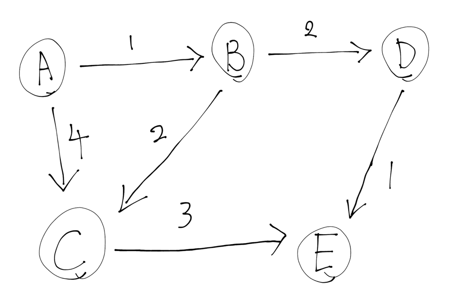

# 다익스트라
어떤 그래프 G와 시작 정점 st가 주어질 때, st로부터 다른 모든 정점으로의 최단 경로 길이를 구하는 알고리즘

다익스트라 알고리즘은 매 단계마다 도달할 수 있는 정점 중에서 시작점으로부터의 거리가 가장 가까운 정점을 구해서 그 거리를 확정하는 방식으로 동작한다.

## 알고리즘 특징
다익스트라 알고리즘은 다음과 같은 특징을 가진다.
- 만약 간선의 가중치(어떤 정점에서 정점으로 이동하는 비용)가 음수라면 다익스트라는 동작할 수 없다. (만약 음수의 가중치를 가진 간선 그래프에서 최단거리를 구할때에는 벨만포드 알고리즘을 사용할 수 있다.)

## 동작 과정
1. 시작점에서 모든 정점까지의 거리를 초기화.
   2. 거리 초기화는 일반적으로 INF(`Integer.MAX_VALUE`)와 같은 존재할 수 없는 아주 큰값으로 설정 (최단거리를 찾는 알고리즘이기 때문에, 최단거리로 판단하지 않기 위해 최대한 큰값으로 설정해야 한다.)
2. 가장 가까운 정점을 선택하고 그 정점의 이웃(인접) 정점들의 거리를 __업데이트__
   3. 이 때 기존 거리보다 작은 경우에만 업데이트 한다.
3. 모든 정점을 방문할 때까지 반복.

### 동작 과정 예시
- A에서 시작
   -  A의 거리는 0, A에서 갈 수 있는 정점 B와 C.
   - A에서 B: 1 (업데이트: B=1)
   - A에서 C: 4 (업데이트: C=4)
- 가장 가까운 정점 B 선택
   - B의 거리는 1, B에서 갈 수 있는 정점 D와 C.
   - B에서 D: 1 + 2 = 3 (업데이트: D=3)
   - B에서 C: 1 + 2 = 3 (기존 C의 거리는 4이므로 업데이트: C=3)
- 가장 가까운 정점 D 선택
   - D의 거리는 3, D에서 갈 수 있는 정점 E.
   - D에서 E: 3 + 1 = 4 (업데이트: E=4)
- 가장 가까운 정점 C 선택
   - C의 거리는 3, C에서 갈 수 있는 정점 E.
   - C에서 E: 3 + 3 = 6 (기존 E의 거리는 4이므로 업데이트하지 않음)
- 가장 가까운 정점 E 선택
   - E의 거리는 4, 모든 정점을 방문했으므로 종료.

결과

|정점|거리|
|------|---|
|A|0|
|B|1|
|C|3|
|D|3|
|E|4|

### 동작 과정 시각화

https://visualgo.net/en/sssp 에서 시뮬레이션 가능

