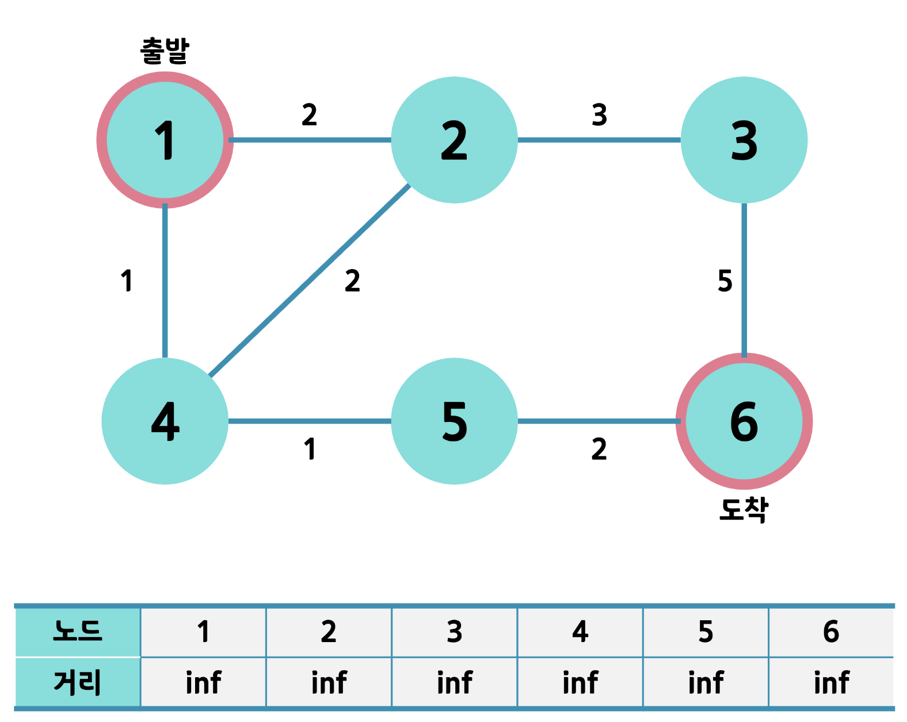
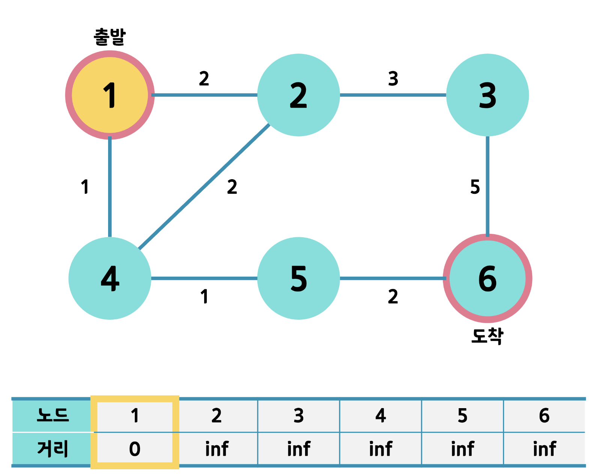
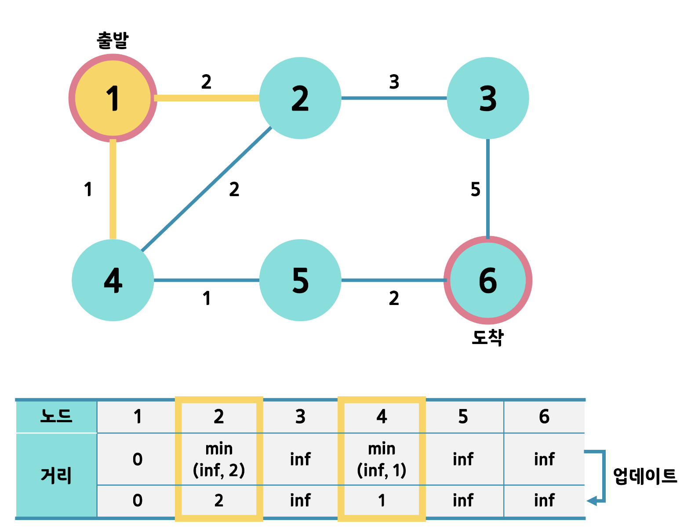
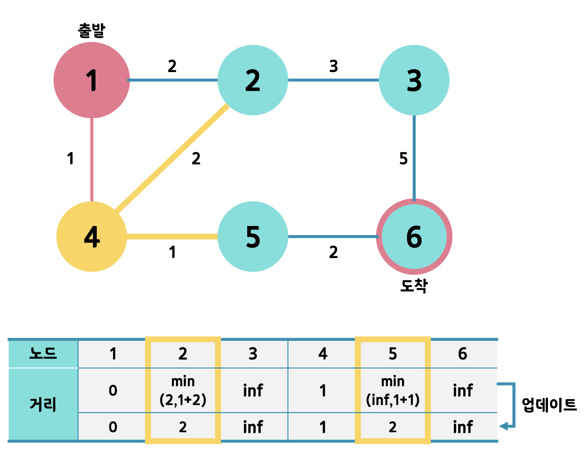
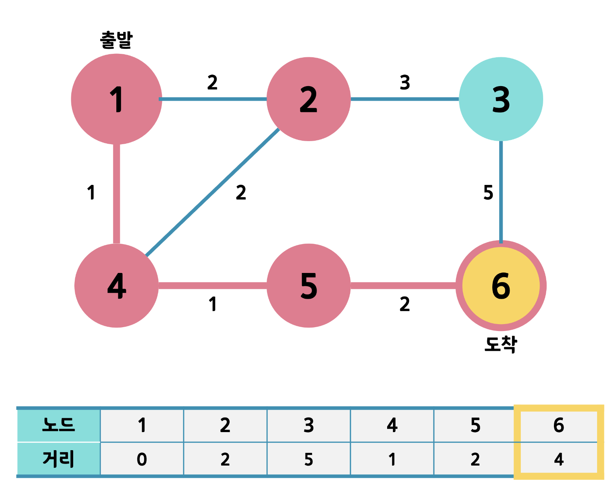

# 다익스트라
다익스트라 알고리즘은 음의 가중치가 없는 그래프의 한 노드에서 각 모든 노드까지의 최단거리를 구하는 알고리즘

## 다익스트라 알고리즘
다익스트라 알고리즘은 그리디 또는 다이나믹 프로그래밍 알고리즘을 사용한다

- 그리디: 방문하지 않은 노드 중에서 가장 비용이 적은 노드를 선택
- DP: 해당 노드로부터 갈 수 있는 노드들의 비용을 갱신

가장 빠르게 해답에 도달하는 경로를 찾아내는 대부분의 문제에 응용

## 구현 방법
1. 최단 거리 테이블을 초기화(모두 최대값 = 무한대)
2. 인접 노드 중 방문하지 않은 노드를 구분하고 방문하지 않은 노드 중 가장 짧은 노드를 선택한다
3. 해당 노드를 거쳐 다른 노드로 넘어가는 간선 비용을 계산하여 최단 거리 테이블을 업데이트 한다
4. 위 과정을 반복

## 구현 예

