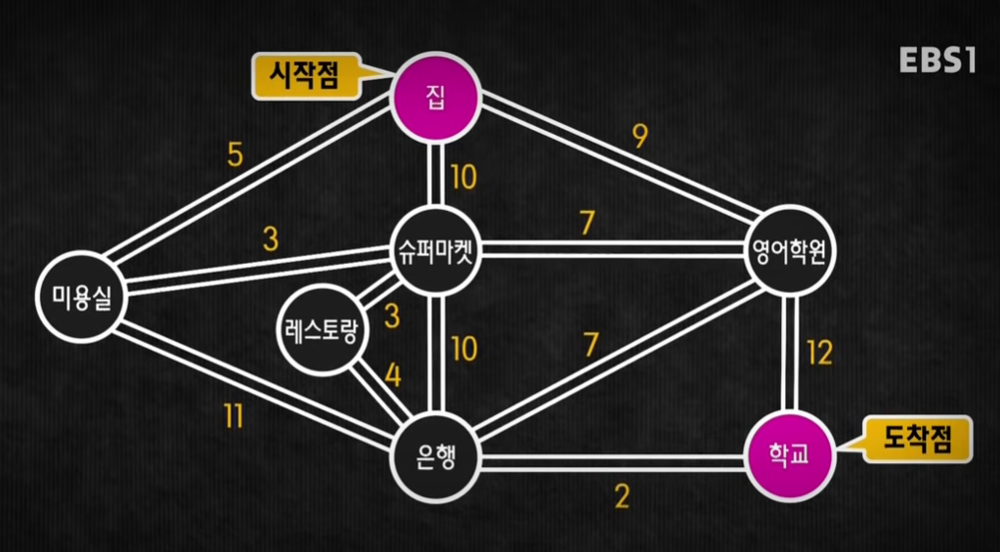

# 다익스트라 알고리즘 (Dijkstra)
## 개념
그래프의 한 정점에서 모든 정점까지의 최단거리를 각각 구하는 알고리즘(최단 경로 문제, Shortest Path Problem) 이다.

다익스트라 알고리즘은 DP(다이나믹 프로그래밍)을 활용한 알고리즘으로 알려져 있음\
하지만 항상 최선의 결과만을 도출해내면 목적지에 도달하기 때문에 그리디 알고리즘이라고도 볼 수 있음

그렇기 때문에 DP의 특성을 가지고 있다.
- **중복된 하위 문제**(**Overlapping Subproblems):** 문제를 해결하는 과정에서 동일한 하위 문제가 반복적으로 발생하여, 이를 한 번만 계산하고 그 결과를 저장해 두었다가 필요할 때 재사용할 수 있음
- **최적 부분 구조 (Optimal Substructure)**: 복잡한 큰 문제의 최적 해결 방법이 그 문제의 하위 문제들의 최적 해결 방법으로부터 구성될 수 있다는 성질입니다. 즉, 하위 문제의 최적 해결책을 결합하여 전체 문제의 최적 해결책을 얻을 수 있습니다.

다익스트라 알고리즘은 출발지에서 목적지까지의 비용을 계산하기 위한 알고리즘으로 출발지와 목적지 사이에 있는 간선의 비용의 합을 계산하면 알 수 있다.

# 알고리즘
https://youtu.be/tZu4x5825LI

1. 출발 노드와 다른 노드간 최단거리를 나타낼 표를 만든다.
2. 출발지에서 도달할 수 있는 노드간의 최단거리를 계산한다. 
   - 한번에 도달할 수 없는 노드는 빈칸으로 둔다.
3. 방문하지 않은 노드 중 가장 비용이 낮은 순부터 방문한다.
4. 방문한 노드에서 도달할 수 있는 노드 중 아직 방문하지 않은 노드의 비용을 계산한다.
   - 이전 노드에서 계산한 비용보다 낮을 경우 갱신한다.
5. 3~4번을 반복한다.
6. 더이상 방문할 수 있는 노드가 없다면 종료한다.

| 집 | 미용실 V | 슈퍼마켓 V | 영어학원 V | 레스토랑 V | 은행 V | 학교 |
| --- | --- | --- | --- | --- | --- | --- |
| 0 | 5 | 8 | 9 | 11 | 15 | 17 |

## 방문 순서

| 집 | 미용실 | 슈퍼마켓 | 영어학원 | 레스토랑 | 은행 | 학교 |
| --- | --- | --- | --- | --- | --- | --- |
| 0 | 5 | 10 | 9 | -1 | -1 | -1 |
| 0 | 5 | 8 | 9 | -1 | 16 | -1 |
| 0 | 5 | 8 | 9 | 11 | 16 | -1 |
| 0 | 5 | 8 | 9 | 11 | 16 | 21 |
| 0 | 5 | 8 | 9 | 11 | 15 | 21 |
| 0 | 5 | 8 | 9 | 11 | 15 | 17 |

## 특징
음의 간선이 있을 경우에는 사용이 불가능하다.
이유는 각 노드에서 다음 노드의 거리를 계산하는 방법이 그리디로 동작하기 때문\
한번 결정한 값은 변경되지 않기 때문에 음의 가중치가 있을 경우 모순이 발생하게 된다.

음의 가중치를 사용할 경우 벨만-포드 알고리즘, SPFA 를 사용 가능하다고 함

시간복잡도
- 기본적인 알고리즘의 시간복잡도는 O(N^2)
  - 알고리즘 3번 방문하지 않은 노드 중 가장 비용이 낮은 순부터 방문한다를 반복문으로 구현했을 경우
- 우선순위 큐를 사용하면 O(NlogN)
  - 알고리즘 3번 방문하지 않은 노드 중 가장 비용이 낮은 순부터 방문한다에 적용

하나의 노드로부터 최단 경로를 구하는 알고리즘, 모든 노드의 최단경로를 알고 싶다면 플로이드-워셜 알고리즘을 사용