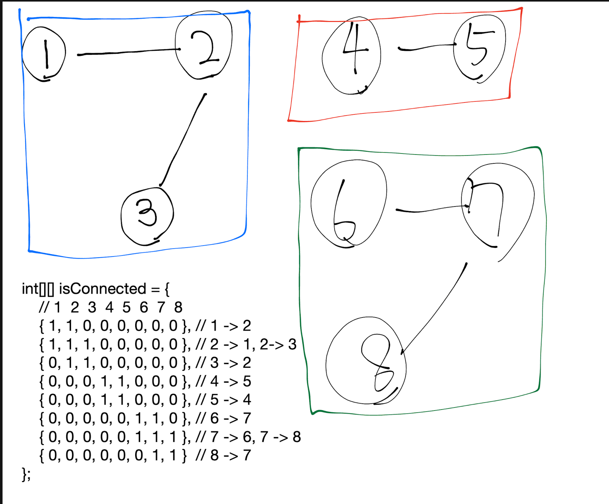

# [Number of Provinces](https://leetcode.com/problems/number-of-provinces/description/)

# 코드

```java
class Solution {
    int[] vis = new int[201];
    int n;
    int[][] graph;
    int ans;

    public int findCircleNum(int[][] isConnected) {
        n = isConnected.length;
        graph = isConnected;

        // n개의 모든 도시를 대상으로 BFS 그룹탐색을 해본다.
        for (int i = 0; i < n; i++) {
            if (vis[i] == 0) {
                bfs(i);
            }
        }

        return ans;
    }

    private void bfs(int start) {
        Queue<Integer> q = new ArrayDeque<>(201);
        // bfs 시작이 됐다라는것은 새로운 도시 그룹 하나를 발견 했다는 것
        ans++;
        q.offer(start);
        vis[start] = 1;

        while(!q.isEmpty()) {
            int cur = q.poll();

            for(int i = 0; i < n; i++) {
                // 연결이 안되어있거나, 이미 방문했다면 넘어감
                if(graph[cur][i] == 0 || vis[i] == 1) {
                    continue;
                }

                q.offer(i);
                vis[i] = 1;
            }
        }
    }
}
```

# 접근 및 풀이방법

1. 그래프탐색(BFS or DFS)은 그래프에 존재하는 모든 간선을 통해 결국 모든 노드를 방문한다.
    1. 단 이 문제의 경우 그래프가 양방향 간선이 존재하기 때문에 반드시 방문체크 필요 (방문체크하지 않으면 순환적으로 방문하게 되므로 무한 방문 문제 발생)
    2. 그래프탐색의 경우 시간복잡도는 O(V+E) = O(Vertex + Edge) 이므로, 이 문제의 경우  $V = n (도시의 수), E = O(n^2)$ (최악의 경우) 이다.
2. 즉 1번 특성을 활용하여, 만약 간선이 있는 어떤 노드에서 그래프탐색을 시작했다면 그 노드의 부분 그래프그룹을 모두 탐색할 수 있음
    1. (단 전체그래프 중에서 연결되지 않은 다른 부분 그래프그룹은 탐색할 수 없음)
3. 2.a 와 같은 조건 때문에, 이 문제의 전체 **Provinces 갯수를 세려면 아직 방문하지 않은 노드가 있다면 그 노드로부터 그래프탐색을 전부 해보아야 한다.**

연결 그래프 구조에서 각 연결된 그룹의 갯수를 세려면 전체 노드를 대상으로 방문체크를 함께하는 그래프탐색을 해주고, 그래프탐색이 시작되는 조건이 즉 그 그룹이 발견된 시점이 된다.


